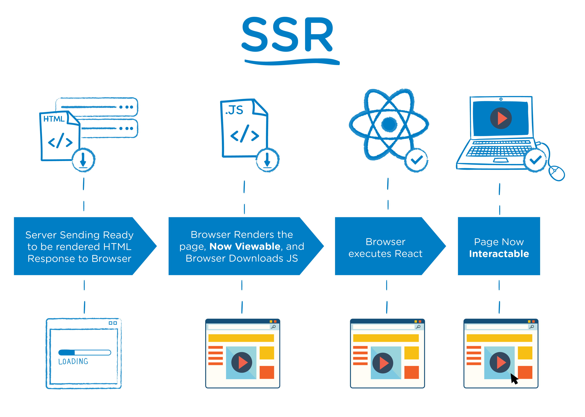

> 客户端渲染

* CSR：Client Side Rendering
* 服务器端仅返回 JSON 数据, DATA 和 HTML 在客户端进行渲染.
* 首屏等待时间长, 用户体验差, 页面结构为空, 不利于 SEO


> 服务器端渲染

* SSR：Server Side Rendering
* 服务器端返回HTML, DATA 和 HTML 在服务器端进行渲染.



## 项目结构

* react-ssr
    * src
       * client 客户端代码
       * server 服务器端代码
       * share 同构代码


(同构指的是代码复用. 即实现客户端和服务器端最大程度的代码复用.)

## 实现 React SSR

1. 引入要渲染的 React 组件
2. 通过 renderToString 方法将 React 组件转换为 HTML 字符串
3. 将结果HTML字符串想到到客户端

> renderToString 方法用于将 React 组件转换为 HTML 字符串, 通过 react-dom/server 导入.


## webpack 打包配置

```js
// webpack.server.js
const path = require('path')

module.exports = {
    mode: 'development',
    target: 'node',
    entry: './src/server/index.js',
    output: {
        path: path.join(__dirname, 'build'),
        filename: 'bundle.js'
    },
    module: {
        rules: [
            {
                test: /\.js$/,
                exclude: /node_modules/,
                use: {
                    loader: 'babel-loader',
                    options: {
                        presets: ['@babel/preset-env', '@babel/preset-react']
                    }
                }
            }
        ]
    }
}
```

## 项目启动命令配置

1. 配置服务器端打包命令: "dev:server-build": "webpack --config webpack.server.js --watch"
2. 配置服务端启动命令: "dev:server-run": "nodemon --watch build --exec \"node build/bundle.js\""

