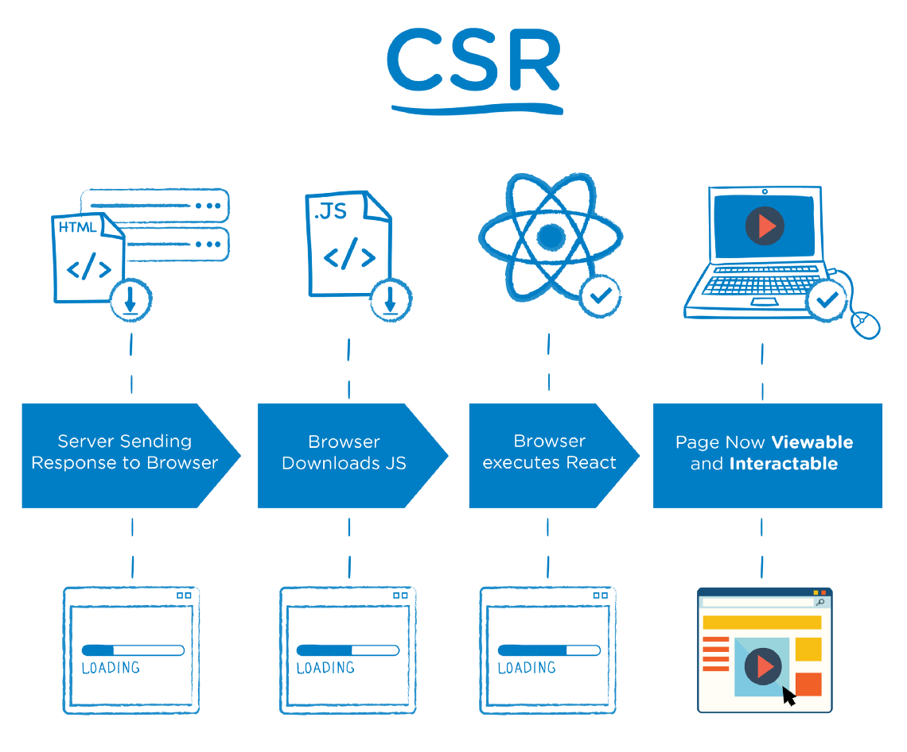

> 客户端渲染

* CSR：Client Side Rendering
* 服务器端仅返回 JSON 数据, DATA 和 HTML 在客户端进行渲染.
* 首屏等待时间长, 用户体验差, 页面结构为空, 不利于 SEO

> 服务器端渲染

* SSR：Server Side Rendering
* 服务器端返回HTML, DATA 和 HTML 在服务器端进行渲染.

## 项目结构

* react-ssr
    * src
       * client 客户端代码
       * server 服务器端代码
       * share 同构代码

(同构指的是代码复用. 即实现客户端和服务器端最大程度的代码复用.)